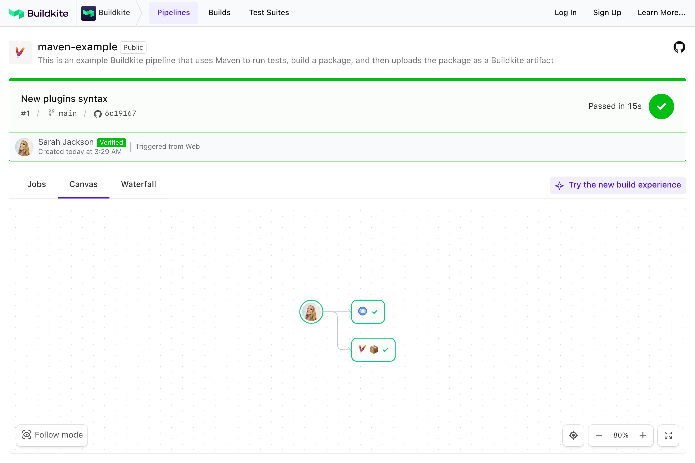

# Buildkite Maven Example

This repository is an example of testing and packaging a [Maven](http://maven.apache.org) project using [Buildkite](https://buildkite.com).
It demonstrates how to run unit tests, build a JAR file, and upload it as a [Buildkite artifact](https://buildkite.com/docs/builds/artifacts).

👉 **See this example in action:** [buildkite.com/buildkite/maven-example](https://buildkite.com/buildkite/maven-example)

See the full [Getting Started Guide](https://buildkite.com/docs/guides/getting-started) for step-by-step instructions on how to get this running, or try it yourself:

---

## How it works

This example:
- Uses Maven to run tests and build a package.
- Uploads the resulting JAR file as a Buildkite artifact.
- Runs using:
  - A Docker container via [the Docker Compose Buildkite Plugin](https://github.com/buildkite-plugins/docker-compose-buildkite-plugin), or
  - A local agent with `mvn` in your `$PATH`.

It's also designed to work well on the [Elastic CI Stack for AWS](https://github.com/buildkite/elastic-ci-stack-for-aws).

---

## Requirements

- A [Buildkite agent](https://buildkite.com/docs/agent)
- ✅ No manual setup — Java and Maven are handled by Docker Compose
- **Optional:** To run outside Docker, you'll need:
  - Java (JDK 8+)
  - [Maven](https://maven.apache.org) installed and available in your `$PATH`

## License

See [LICENSE.md](LICENSE.md) (MIT)